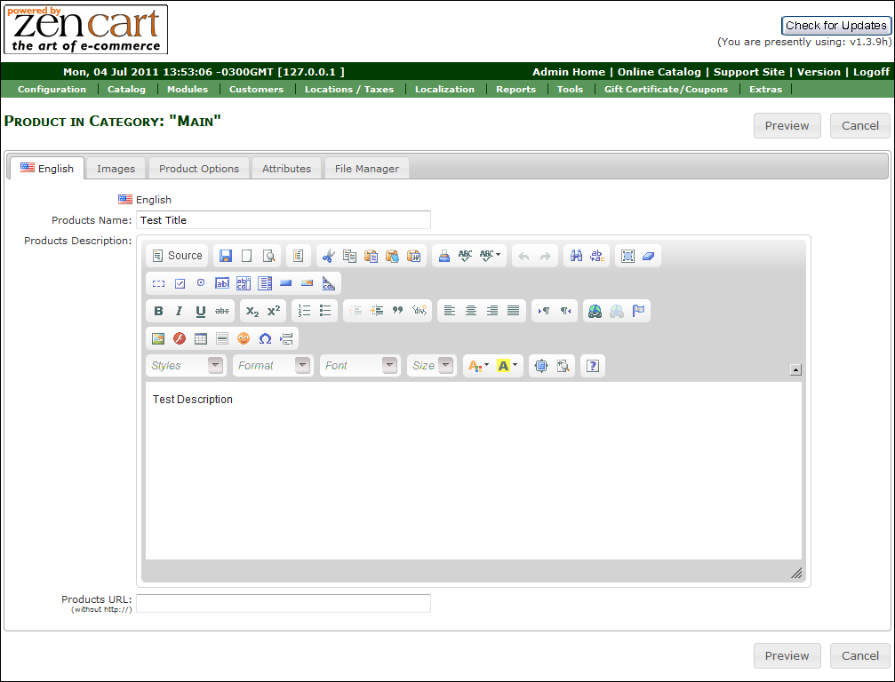
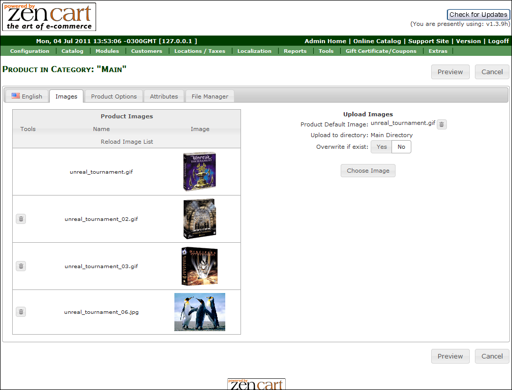
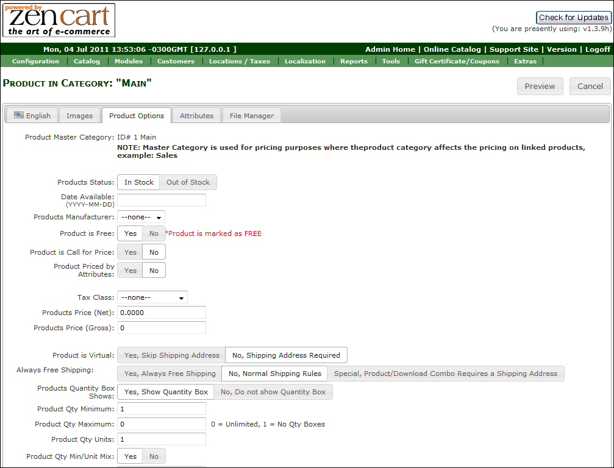
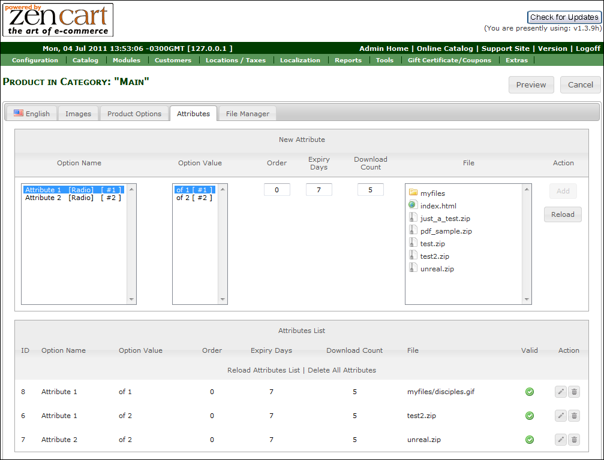
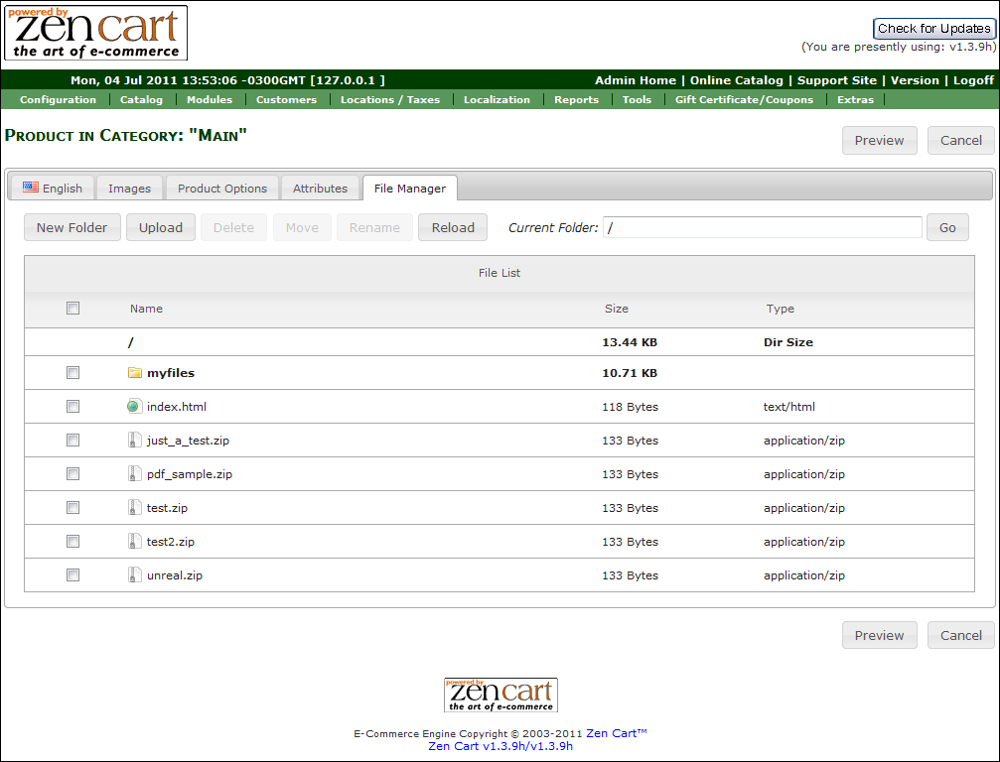

**AIO Product Page** is a module for [Zen
Cart](http://www.zen-cart.com) AIO Product Page (all-in-one product page) is a module developed by Custom Scriptz for Zen Cart that gives you everything you need to edit and manage your product details, images, attributes and files.

*Copyright* 2003-2019 Zen Cart Development Team
*Copyright* Portions Copyright 2003 osCommerce

*Author* Diego Vieira - https://customscriptz.com

 
 
 
 

# System Requirements

[Zen Cart v1.3.8a or newer](http://www.zen-cart.com)  
[PHP 5 or newer](http://php.net)  
[MySQL 5 or newer](http://www.mysql.com)

# Installation Instructions
- If your "admin" directory has a different name, rename the dir "admin" dir that's inside the "uploads" dir to match yours.
- Now, upload all the contents of the dir "uploads" to the root of your store. Don't upload the "uploads" dir, but what's inside of it. There are no overwrites.
- Go to "/admin" and rename the file "product.php" to "_product.php" (in case the product type you are replacing is product)
- Go to "/admin/includes/languages/YOUR_LANGUAGE" and rename the file "product.php" to "_product.php"
- Go to "/admin/includes/modules" and rename the dir "product" to "_product"

### Inside the upload package
- Go to "/admin" and rename the file "aio_product.php" to "product.php" (in case the product type you are replacing is product)
- Go to "/admin/includes/languages/YOUR_LANGUAGE" and rename the file "aio_product.php" to "product.php"
- Go to "/admin/includes/modules" and rename the file "aio_product.php" to "product.php"
- Upload all contents of the dir "uploads" to the root of your shop (don't upload the dir "uploads", but what is inside of it). There are no overwrites.
- After uploading all files, upload the "extras". Remember to rename the "admin" dir as well that's inside the "extras" dir.

### Back to the store files
Go to "/admin" and rename the file ".htaccess" to "default.htaccess", then rename the file "aio.htaccess" to ".htaccess"
Go to "/admin/includes" and rename the file ".htaccess" to "default.htaccess", then rename the file "aio.htaccess" to ".htaccess"

## Settings
There are no settings for this module.

## Tutorial
- Go to Store Admin -> Catalog -> Categories/Products
- Edit or Insert a New Product
- You should be able to see the AIO page.

# License

[GNU GPL license v2](LICENSE)

# Disclaimer
Please note: all tools/scripts in this repo are released for use "AS IS" without any warranties of any kind, including, but not limited to their installation, use, or performance. We disclaim any and all warranties, either express or implied, including but not limited to any warranty of noninfringement, merchantability, and/or fitness for a particular purpose. We do not warrant that the technology will meet your requirements, that the operation thereof will be uninterrupted or error-free, or that any errors will be corrected.

Any use of these scripts and tools is at your own risk. There is no guarantee that they have been through thorough testing in a comparable environment and we are not responsible for any damage or data loss incurred with their use.

You are responsible for reviewing and testing any scripts you run thoroughly before use in any non-testing environment.